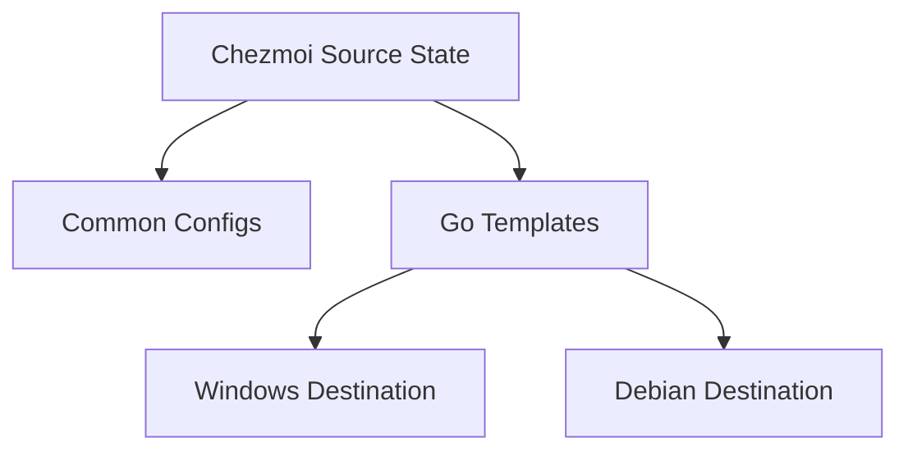

# Multi-Platform Dotfiles System

**Author:** Jimminator
**Status:** Draft
**Last Updated:** 2026-02-02

---

## 1. Context & Background
The user maintains a heterogeneous computing environment consisting of **Windows Thin Clients**, **WSL (Windows Subsystem for Linux)**, and **Debian-based MobileLab** units. Managing configuration files (dotfiles) across these disparate platforms manually leads to drift, inconsistency, and overhead during setup.

This project aims to unify the management of these environments using a single "Source of Truth" repository.

## 2. Goals & Non-Goals

### Goals
*   **Uniformity**: Ensure core tools (Git, Neovim, Shell aliases) behave consistently across OSs.
*   **Automation**: Minimize manual intervention when bootstrapping a new machine.
*   **Platform Specificity**: Allow for divergent configs where necessary (e.g., Windows paths vs. Linux paths).
*   **Security**: Provide a path for managing sensitive credentials (SSH keys, API tokens).
*   **Connectivity**: Utilize **Tailscale** for a seamless, secure mesh VPN across all platforms and roles.

### Non-Goals
*   Full system imaging or OS-level configuration (e.g., Ansible/Terraform for system state).
*   Managing large binary assets or application state (databases, browser profiles).

### 2.3. User Stories
*   **The Seamless Dev**: "I just bought a new laptop. I run `install.ps1`, choose `workstation`, and within 5 minutes, my terminal, Neovim, and Git are perfectly configured and my SSH keys are pulled from Bitwarden."
*   **The WSL Bridge**: "I work in WSL daily. My aliases in Ubuntu are identical to my PowerShell aliases, making the boundary between OSs feel invisible."
*   **The Safe Admin**: "I'm logged into 10 different Debian servers. Because I chose the `server` role, my prompt clearly screams `[SERVER]`, preventing me from running a reboot command on the wrong machine."
*   **The Secret Keeper**: "I need to share my SSH config across machines but don't want it on GitHub. I store the sensitive parts in Bitwarden, and Chezmoi injects them on the fly."

## 3. Architecture

### 3.1. Tooling Selection: Chezmoi
We have selected **Chezmoi** as the management engine over traditional symlink managers (like GNU Stow) for the following reasons:
*   **Natively Cross-Platform**: Functions via a "copy-and-transform" model, avoiding symlink permission issues on Windows.
*   **Go-Templating**: Allows for dynamic file generation based on environment variables, OS, or hostname.
*   **Robust State Management**: Tracks changes between the repo and the target machine effectively.

### 3.2. Directory Structure
The repository is organized to separate shared logic from environment-specific overrides:



*   `dot_bashrc`: Linux-specific shell entry point.
*   `dot_gitconfig.tmpl`: Generalized Git configuration with identity templates.

### 3.3. Role Architecture
To avoid "configuration bloat," we categorize machines by their primary function (**Role**). A role dictates which sets of aliases, tools, and security policies are applied.

| Role | Codename | Target Hardware | Primary Function | Software & Security |
| :--- | :--- | :--- | :--- | :--- |
| **Commander** | `commander` | XPS 13 / Mac | **Control Center**. Administering servers, Managing clusters. "The Nuclear Football". | **GUI**: VS Code, Antigravity. **CLI**: K9s, Ansible. **Security**: Master Keys. |
| **Workstation** | `workstation` | PC Co (Win/WSL) | **Heavy Lifter**. Daily coding, Compiling, AI Training. | **GUI**: VS Code, Docker Desktop. **OS**: WSL. **Security**: Master Keys. |
| **Mobile Lab** | `mobilelab` | XPS 15 (Debian) | **Infrastructure**. Portable Lab. KVM Hypervisor. | **OS**: Debian Native. **CLI**: virt-manager, bridge-utils. **Security**: Deploy Keys. |
| **Server** | `server` | VPS (1GB RAM) | **Gateway**. Headless. Reverse Proxy. | **CLI**: Minimal (Git, Curl, Nginx). No heavy tools. **Security**: Agent Forwarding. |

## 4. Technical Strategy

### 4.1. Cross-Platform Logic
We utilize Chezmoi's built-in variables (`.chezmoi.os`, `.chezmoi.hostname`) to handle platform differences.

**Example: Path Handling**
```handlebars
{{- if eq .chezmoi.os "windows" -}}
$editor = "nvim.exe"
{{- else -}}
export EDITOR="nvim"
{{- end -}}
```

### 4.2. Bootstrap Process
A single command approach is prioritized for each platform via dedicated scripts:
1.  **Windows**: `install.ps1` handles Winget check, Chezmoi installation, and local source linking.
2.  **Debian**: `install.sh` handles binary installation and application of state.

### 4.3. Unified Alias Architecture
To maintain consistency, we use a shared template fragment for aliases. This allows defining an alias once and having it correctly translated to PowerShell syntax or Bash syntax.

*   **Windows**: `winget` integration.
*   **Debian**: `apt` (or `nala` if available).

### 4.5. Line Endings (CRLF vs LF) Mitigation
To prevent "Line Ending" conflicts (CRLF on Windows vs LF on Linux), we enforce a `.gitattributes` policy:
*   Scripts (`.sh`, `.ps1`) are fixed to their respective native line endings.
*   Templates (`.tmpl`) are handled by Chezmoi, but we use Git to ensure they are stored as LF to avoid template parsing errors on Linux.

## 5. Security & Secrets
Sensitive files (like `.ssh/config`) will be stored using Chezmoi's `private_` prefix. For actual secrets (keys), we utilize a **Role-Based SSH Strategy**:

*   **Bitwarden CLI (`bw`)**: Primary secret provider.
*   **Key Storage Strategy**:
    *   `commander` & `workstation`: Auto-pull `id_ed25519` (Master Ed25519 Key) from Bitwarden note `ssh-key-master-ed25519`.
    *   `mobilelab` & `server`: Auto-pull `id_ed25519_server` (Server Ed25519 Key) from Bitwarden note `ssh-key-server-ed25519`.
    *   **Cross-Machine Access**: `workstation` automatically authorizes `commander` by pulling the Master Public Key from Bitwarden into `authorized_keys`.

## 6. Future Considerations
*   **Package Management**: Linking `Brewfile`, `scoop export`, and `apt bundle` lists to the dotfiles lifecycle.
*   **CI/CD**: Automatic linting of shell scripts and templates via GitHub Actions.
