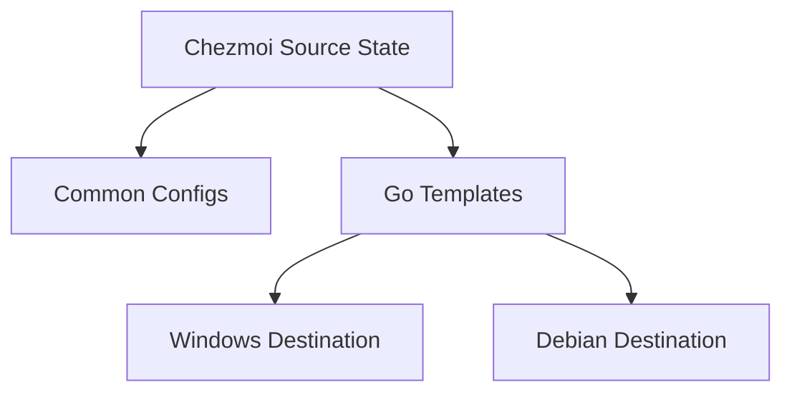

# Multi-Platform Dotfiles System

**Author:** Jimminator
**Status:** Draft
**Last Updated:** 2026-02-02

---

## 1. Context & Background
The user maintains a heterogeneous computing environment consisting of **Windows Thin Clients**, **WSL (Windows Subsystem for Linux)**, and **Debian-based MobileLab** units. Managing configuration files (dotfiles) across these disparate platforms manually leads to drift, inconsistency, and overhead during setup.

This project aims to unify the management of these environments using a single "Source of Truth" repository.

## 2. Goals & Non-Goals

### Goals
*   **Uniformity**: Ensure core tools (Git, Neovim, Shell aliases) behave consistently across OSs.
*   **Automation**: Minimize manual intervention when bootstrapping a new machine.
*   **Platform Specificity**: Allow for divergent configs where necessary (e.g., Windows paths vs. Linux paths).
*   **Security**: Provide a path for managing sensitive credentials (SSH keys, API tokens).
*   **Connectivity**: Utilize **Tailscale** for a seamless, secure mesh VPN across all platforms and roles.

### Non-Goals
*   Full system imaging or OS-level configuration (e.g., Ansible/Terraform for system state).
*   Managing large binary assets or application state (databases, browser profiles).

### 2.3. User Stories
*   **The Seamless Dev**: "I just bought a new laptop. I run `install.ps1`, choose `workstation`, and within 5 minutes, my terminal, Neovim, and Git are perfectly configured and my SSH keys are pulled from Bitwarden."
*   **The WSL Bridge**: "I work in WSL daily. My aliases in Ubuntu are identical to my PowerShell aliases, making the boundary between OSs feel invisible."
*   **The Safe Admin**: "I'm logged into 10 different Debian servers. Because I chose the `server` role, my prompt clearly screams `[SERVER]`, preventing me from running a reboot command on the wrong machine."
*   **The Secret Keeper**: "I need to share my SSH config across machines but don't want it on GitHub. I store the sensitive parts in Bitwarden, and Chezmoi injects them on the fly."

## 3. Architecture

### 3.1. Tooling Selection: Chezmoi
We have selected **Chezmoi** as the management engine over traditional symlink managers (like GNU Stow) for the following reasons:
*   **Natively Cross-Platform**: Functions via a "copy-and-transform" model, avoiding symlink permission issues on Windows.
*   **Go-Templating**: Allows for dynamic file generation based on environment variables, OS, or hostname.
*   **Robust State Management**: Tracks changes between the repo and the target machine effectively.

### 3.2. Directory Structure
The repository is organized to separate shared logic from environment-specific overrides:



*   `dot_bashrc`: Linux-specific shell entry point.
*   `dot_gitconfig.tmpl`: Generalized Git configuration with identity templates.

### 3.3. Role Architecture: "The Mythos"
We categorize machines using a mythological naming convention that reflects their power and function.

| Role | Name | Concept | Primary Function |
| :--- | :--- | :--- | :--- |
| **Commander** | **`centaur`** | *Chiron (The Wise)* | **Control Center**. Laptop/Mac. Admin tools, Master Keys. |
| **Workstation** | **`chimera`** | *The Hybrid* | **Heavy Lifter**. Windows+WSL. Dev tools, Docker. |
| **HomeLab** | **`hydra`** | *The Undying* | **Proxmox Cluster**. Bare metal virtualization. Minimal host. |
| **MobileLab** | **`griffin`** | *The Guardian* | **Debian Laptop**. Portable KVM virtualization. |
| **Storage** | **`kraken`** | *The Deep* | **Ceph Cluster**. Distributed storage nodes. |
| **Server** | **`cyclops`** | *The Strong* | **Generic Server**. Headless, single-purpose. |
| **Bastion** | **`cerberus`** | *The Gatekeeper* | **Gateway**. VPN/SSH Jump host. Hardened. |
| **Database** | **`golem`** | *The Construct* | **Stateful Node**. Postgres/Redis storage. |
| **Worker** | **`minion`** | *The Laborer* | **Compute Node**. CI Runners, Docker Swarm workers. |
| **Web** | **`siren`** | *The Allure* | **Frontend**. Nginx/Proxy. Public facing. |

### 3.4. Package Management Strategy
To avoid script bloat, we decouple data from logic.
*   **Source of Truth**: [`packages.yaml`](packages.yaml) contains the definitive list of software for every OS and Role.
*   **Execution**: Installation scripts (`.ps1.tmpl`, `.sh.tmpl`) dynamically parse this YAML at runtime to determine what to install.

### 3.5. Naming & Connectivity (Network Layer)
Instead of static IP tables, we utilize **Tailscale MagicDNS** for dynamic service discovery.

**Naming Convention**:
To ensure machines are identifiable within the Tailnet:
*   **Format**: `[MythologicalName]`
*   **Examples**:
    *   `chiron` (Centaur/Commander)
    *   `leo` (Chimera/Workstation)
    *   `polyphemus` (Cyclops/Server)
*   **Why?**: Names are chosen from unique pools per role, ensuring no collision. A role suffix is redundant.

## 4. Technical Strategy

### 4.1. Cross-Platform Logic
We utilize Chezmoi's built-in variables (`.chezmoi.os`, `.chezmoi.hostname`) to handle platform differences.

**Example: Path Handling**
```handlebars
{{- if eq .chezmoi.os "windows" -}}
$editor = "nvim.exe"
{{- else -}}
export EDITOR="nvim"
{{- end -}}
```

### 4.2. Bootstrap Process
A single command approach is prioritized for each platform via dedicated scripts:
1.  **Windows**: `install.ps1` handles Winget check, Chezmoi installation, and local source linking.
2.  **Debian**: `install.sh` handles binary installation and application of state.
*   *Both scripts maintain feature parity (ANSI colors, error handling, idempotent logic).*

### 4.3. Unified Alias Architecture
To maintain consistency, we use a shared template fragment for aliases. This allows defining an alias once and having it correctly translated to PowerShell syntax or Bash syntax.

*   **Windows**: `winget` integration.
*   **Debian**: `apt` (or `nala` if available).

### 4.5. Line Endings (CRLF vs LF) Mitigation
To prevent "Line Ending" conflicts (CRLF on Windows vs LF on Linux), we enforce a `.gitattributes` policy:
*   Scripts (`.sh`, `.ps1`) are fixed to their respective native line endings.
*   Templates (`.tmpl`) are handled by Chezmoi, but we use Git to ensure they are stored as LF to avoid template parsing errors on Linux.

## 5. Security & Secrets
Sensitive files (like `.ssh/config`) will be stored using Chezmoi's `private_` prefix. For actual secrets (keys), we utilize a **Role-Based SSH Strategy**:

*   **Bitwarden CLI (`bw`)**: Primary secret provider.
*   **Key Storage Strategy**:
    *   `commander` & `workstation`: Auto-pull `id_ed25519` (Master Ed25519 Key) from Bitwarden note `ssh-key-master-ed25519`.
    *   `mobilelab` & `server`: Auto-pull `id_ed25519_server` (Server Ed25519 Key) from Bitwarden note `ssh-key-server-ed25519`.
    *   **Public Key Derivation**: To ensure consistency, Public Keys (`.pub`) are **not** stored in Bitwarden. Instead, a local `run_onchange_` script automatically derives them from the private keys (`ssh-keygen -y`) whenever the private key template changes.
    *   **Cross-Machine Access**: `workstation` automatically authorizes `commander` by pulling the Master Public Key from Bitwarden into `authorized_keys`.
    *   **Local Overrides**: The managed `config` file includes `config.local*`, allowing users to maintain unmanaged configurations alongside managed ones.

## 6. Maintenance & Operations
*   **Tailscale Auth Key Rotation**: The `tailscale-auth-key` in Bitwarden expires every 90 days.
    *   *Impact*: New machine installations will fail to auto-join Tailscale after expiry. Existing machines are unaffected (due to Tags).
    *   *Action*: Every 3 months (or upon installation failure), generate a new Reusable Key on Tailscale Console and update the `tailscale-auth-key` password in Bitwarden.
*   **SSH Key Rotation**: If Master Keys are compromised, generate new ones, update Bitwarden, and run `chezmoi apply` on all machines.
*   **Configuration Reset**: To change a machine's Role or Hostname after valid initialization, delete `~/.config/chezmoi/chezmoi.toml` and re-run the installer.

## 7. Future Considerations
*   **Package Management**: Linking `Brewfile`, `scoop export`, and `apt bundle` lists to the dotfiles lifecycle.
*   **CI/CD**: Automatic linting of shell scripts and templates via GitHub Actions.
